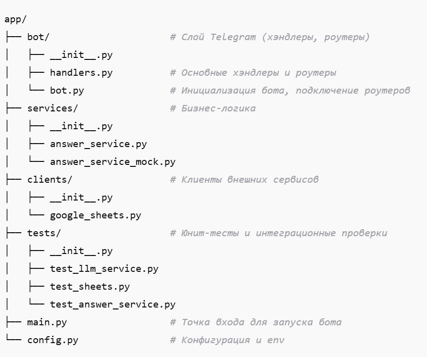
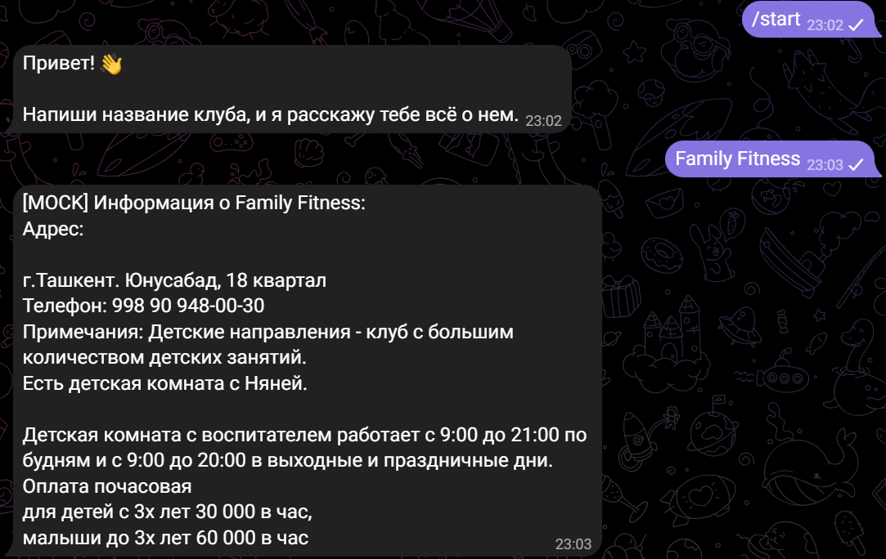
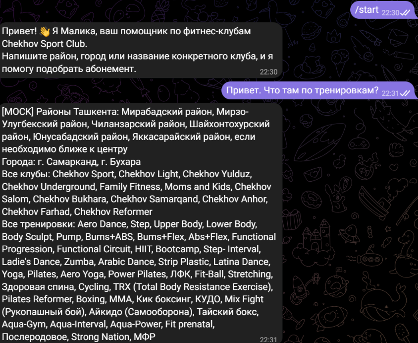

# ChekhovAgent — Telegram AI Bot

📌 Содержание
- [Описание](#-Описание)
- [Технологии](#-Технологии)
- [Функциональность](#-Функциональность)
- [Архитектура проекта](#-Архитектура проекта)
- [Установка и запуск](#-Установка и запуск)
- [Конфигурация окружения](#-Конфигурация окружения)
- [Примеры запросов](#-Примеры запросов)
- [Тестирование](#-Тестирование)
- [To Do](#-To Do)
- [Автор](#-Автор)

## 🧩 Описание
ChekhovAgent — это Telegram-бот, который отвечает на текстовые запросы пользователей, опираясь на актуальные данные из Google Sheets.
Бот предназначен для демонстрации архитектурного подхода к построению AI-агента:
с разделением слоёв,
с реальным чтением данных из внешнего источника (Google Sheets),
с использованием LLM для формирования «причесанного» ответа,
с корректной обработкой ошибок и отсутствия данных.

## ⚙️ Технологии

- Python >= 3.12
- aiogram 3 — Telegram Bot API (async)
- httpx — HTTP-клиент
- Google Sheets API (google-api-python-client)
- OpenAI / DeepSeek API — LLM (или mock-реализация)
- pydantic-settings — конфигурация через env
- pytest, pytest-asyncio — тестирование
- black, isort, flake8 — форматирование и линтинг
- Docker / docker-compose — контейнеризация

## 🧑‍💻 Функциональность

Реализовано:
- Приём текстовых сообщений от пользователя в Telegram
- Онлайн-чтение данных из Google Sheets при каждом запросе
- Поиск релевантной строки в таблице (по названию клуба)
- Формирование ответа с помощью LLM (или mock-LLM)
- Явное использование данных из таблицы в ответе
- Корректная обработка случая, когда данные не найдены
- Логирование:
входящих запросов,
обращений к Google Sheets,
обращений к LLM,
ошибок и исключений
- Юнит-тест бизнес-логики с моками внешних сервисов

## 📁 Архитектура проекта

- **Telegram слой**: обработка апдейтов, маршрутизация сообщений.
- **Слой бизнес-логики**: формирование ответа через LLMService/AnswerService.
- **Клиенты внешних сервисов**: Google Sheets API.
- **Тесты**: юнит-тесты для LLM и моков, проверка бизнес-логики.

## 🛠 Установка и запуск 

1. Клонируем репозиторий:

git clone https://github.com/EugenyBaz/ChekhovAgent.git
cd ChekhovAgent

2. Создаём .env (можно скопировать .env.example) с переменными:

TELEGRAM_BOT_TOKEN=<токен вашего бота> 
GOOGLE_SERVICE_ACCOUNT_JSON=<путь к JSON сервисного аккаунта>  
GOOGLE_SHEETS_SPREADSHEET_ID=<ID таблицы> 
DEEPSEEK_API_KEY=<ключ DeepSeek или LLM API> 
DEEPSEEK_BASE_URL=https://api.deepseek.com  
USE_MOCK_LLM=True   # True — замоканный LLM, False — реальный DeepSeek 

- USE_MOCK_LLM=True — бот будет возвращать ответы необработанные LLM ([MOCK] …) для быстрого тестирования без внешних API.
- USE_MOCK_LLM=False — бот будет использовать реальный LLM (DeepSeek)

3. Запуск через Docker:

Замоканный режим (быстрый тест):

- команда в терминале: docker-compose up --build

Реальный режим через DeepSeek:

- Убедитесь, что USE_MOCK_LLM=False в .env.
- Убедитесь, что DEEPSEEK_API_KEY валиден.

- команда в терминале: docker-compose up --build

4. Локальный запуск без Docker:

Замоканный режим:
- команда в терминале: poetry install
- команда в терминале: poetry run python main.py

Реальный режим через DeepSeek:
- команда в терминале: poetry install 
- В .env установите USE_MOCK_LLM=False и DEEPSEEK_API_KEY
- команда в терминале: poetry run python main.py

5. Запуск тестов:

- команда в терминале: pytest app/tests/

📝 Примеры запросов

Бот (mock):

Бот (реальный LLM): 

Если запись не найдена:
Не нашёл такую запись в таблице. Попробуйте уточнить запрос.

## 📝 To Do

Расширение функционала
Текущая версия реализует базовый поиск и выдачу информации из таблицы.  
Дальнейшие улучшения, которые можно добавить:  
- распознавание намерения пользователя (приветствие, интерес к абонементам, уточнение клуба);  
- фильтрация и рекомендации абонементов по времени и предпочтениям;  
- учет акций и скидок;  
- более “живой” диалог с уточняющими вопросами.  

## 👤 Автор

Евгений Базавод — Backend Developer